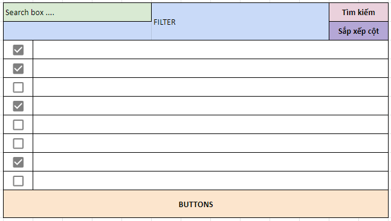

# TableComponent
Đây là component Table đã handle sẵn một số logic cần thiết cho những trang sử dụng Table phức tạp
Dưới đây là một layout khá chung cho một trang sử dụng table



Trong đó có các phần chính như:
- Filter
- Nút tìm kiếm
- Nút chỉnh sửa cột
- Table chính
- Bottom Action Drawer (để hiểu là cái gì, truy cập [Link2.0](http://link2.i3solution.net.au/Search) sau đó check một vài checkbox hoặc check all để xem)

Nhiệm vụ của `TableComponent` là layout và handle các logic cần thiết

### Props
Name | Type | Default | Description
:--- | :--- | :--- | :---
`groupedData` | array of grouped  <sup>(*)</sup> | | data cho table ở dạng grouped
`columnConfig` | array of columnConfigShape <sup>(*)</sup> | | config về thứ cột, ... 
`customRenderMap` | `Map` of custom render | | 
`filterComponent` | node | | phần React node render filter
`onClickSearch` | func | | callback khi nhấn nút search
`onSort` | props này của Table (xem [Table](https://github.com/i3team/i3-table))
`currentOrderBy` | props này của Table (xem [Table](https://github.com/i3team/i3-table))
`pageType` | number | | giá trị của enum EPageType
`selectable` | bool | false | true thì sẽ handle checkbox và bottom drawer
`buttons` | node |  | buttons ở bottom drawer
`canEditColumnConfig` | boolean | `false` | `true` thì hiện nút sắp xếp cột
`renderFooterCells` | func(row, index, visibleColumnsLength, columnConfig): node | | hàm nhận vào 4 parameters và trả về các Cell cho footer
`renderHeaderCells` | func(row, index, visibleColumnsLength, columnConfig): node | | hàm nhận vào 4 parameters và trả về các Cell cho header
`canGroupByColumn` | boolean | `false` | `true` thì hiện dropdown chọn gom nhóm theo cột
`onGroupByColumn` | func(ids) |  | callback sau khi chọn gom nhóm theo cột
`defaultGroupByColumns` | array of number | | list id mặc định của các cột được gom nhóm theo
`onShowingColumnsChanged` | func(ids) | | callback sau khi column config được thay đổi (được dùng để get lại data nếu cần)
`reloadAfterColumnConfigChanged` | bool | `true` | `true` thì sẽ render lại table sau khi thay đổi column config, set là `false` nếu muốn get lại dữ liệu mỗi khi thay đổi column 

<sup>(*)</sup>
```jsx
groupedData: PropTypes.arrayOf(PropTypes.shape({
            key: PropTypes.string.isRequired,
            data: PropTypes.any.isRequired,
            items: PropTypes.array
        }))
columnConfig: PropTypes.arrayOf(PropTypes.shape({
    index: PropTypes.number.isRequired, // thứ tự sắp xếp cột
    key: PropTypes.string.isRequired, // key từ object data
    title: PropTypes.string.isRequired, // tiêu đề cột
    isVisible: PropTypes.bool, // (1) hiển thị
    options: PropTypes.object // (2)
})).isRequired
```

(1) `isVisible` là giá trị default thể hiện cột đó có được display hay ko, `false` thì ko được display, ngược lại `true` hoặc `null` thì display, chỉ khác là `null` thì KO ĐƯỢC edit 

(2) `options` (trước đó là `headCellProps`, chỉ là thêm trường `id`) chứa các props của `HeadCell` của `I3FullTable` và `id` của column `{id, ...headCellProps}`. `id` của column sẽ được lấy từ enum cho việc gom nhóm theo cột, theo đó, khi một table cần chức năng gom nhóm theo cột thì phải định nghĩa ra 1 enum (cả C# lẫn js) với giá trị là number đại diện cho column muốn group, 

Ở js thì tạo object enum trong object `ETableColumnId` ở file `enum.js`
VD:
```jsx
export const ETableColumnId = {
    Test: {
        ConsumableId: 1,
        Status: 2,
        Quantity: 3,
        ConsumableOrderId: 4,
    },
    ... object mới ở đây
}
```
```csharp

public enum Test
{
    ConsumableId = 1,
    Status = 2,
    Quantity = 3,
    ConsumableOrderId = 4,
}
```

Table chỉ cung cấp chức năng chọn cột để gom nhóm, sẽ gọi callback ra ngoài và component sử dụng table sẽ tự động bắn api lấy dữ liệu đã được gom nhóm về.

### Code
```jsx
import { createColumn } from '~/general/tableConfig.js';
// createColumn làm hàm nhận vào các parameter để trả về một object config cho một column
// createColumn = (index, key, title, isVisible, options = null) => ({ index, key, title, isVisible, options });

let _columnConfig = [
    createColumn(1, 'id', 'ID', null, {
        id: ETableColumnId.Test.ConsumableId,
        sortable: true,
        orderBy: 'abc'
    }),
    createColumn(2, 'name', 'Name', true),
    createColumn(3, 'age', 'Age', true),
    createColumn(4, 'city', 'City', true),        
]
// theo code trên thì table có khả năng gom nhóm theo consumable id
let _customRenderMap = new Map();
// custom render trường `id`
_customRenderMap.set('id', row => <b style={{color: 'red'}}>#{row.data.id}</b>)

<TableComponent
    filterComponent={(
        <b>
            filter
        </b>
    )}
    onClickSearch={() => {
        // bắn api search
    }}
    onSort={(sort) => {
       
    }}
    currentOrderBy={'Id'}
    selectable
    getRowKey={row => row.data.id}
    pageType={EPageType.Test}
    groupedData={groupedData}
    columnConfig={_columnConfig}
    customRenderMap={_customRenderMap}
    buttons={(
        <Fragment>
            <EHealthButton width="120px" variant="solid" margin={["no", "no", "no", "md"]}>
                Duyệt
            </EHealthButton>
            <EHealthButton width="120px" variant="outlined" margin={["no", "no", "no", "md"]}>
                Hủy
            </EHealthButton>
        </Fragment>
    )}
/>
```

# Model C# trả về để render table
Đối với table có paging thì trả về ```Pagination<T>```, nếu không thì trả về ```List<T>```.

## 1. Cần truyền T là gì?
### 1.1 Nếu phục vụ cho table có checkbox để tick chọn thì T là ```ActionTableItem<X>```
ActionTableItem là một class chứa các thông tin cần thiết để JS render table (cấu trúc cha-con, quy định item nào render checkbox,...). 

X bắt buộc là một class được kế thừa từ IActionItem (đọc thêm chú ý cuối mục này). Sở dĩ kế thừa interface IActionItem là để ràng buộc mỗi object dùng để render trong table phải luôn có 1 ```List<EActionPoint>```, đây là thông tin để table biết phải xử lý object nào tương ứng với các nút ở drawer (vai trò tương tự thông tin phân quyền của object đó, đọc thêm ở mục 3).

Chú ý: các cách để class kế thừa từ IActionItem
#### a) Các class đang có sẵn [DataContract], [DataMember]: kế thừa từ BaseDataMemberActionItem
Class có [DataContract] nên được kế thừa từ class có [DataContract] nên đã tạo sẵn class BaseDataMemberActionItem để kế thừa cho nhanh. Class này đã implement List EActionPoint từ IActionItem và gắn [DataMember] cho trường đó.

Đối với những class POCO thì tạo file partial và kế thừa.

#### b) Các class không có  [DataContract], [DataMember]: kế thừa từ BaseActionItem

#### c) Các class đã có kế thừa từ class khác: kế thừa trực tiếp interface IActionItem và tự hiện thực.
```cshaph
public class Test: TestClass, IActionItem
    {
        public string Id { get; set; }
        public List<EActionPoint> ActionPoints { get; set; }
        public List<Test2> Details { get; set; }
    }
```

### 1.2 Nếu chỉ để render data, không cần tick chọn thì T là ```TableItem<X>```

Trong đó X là một class tùy chọn, không ràng buộc như mục 1.1

## 2. Cách viết thế nào?
### 2.1 ```ActionTableItem<X>```
Demo với class Test ở mục 1.1.c)

Giả sử ServiceHost trả về một danh sách dữ liệu là ```List<Test>```, mỗi object trong list có trường Details thể hiện danh sách con của nó


```cshaph
var returnData = x.Select(i => TableItemHelper.GetActionInstance(
    					data: i,
    					getKey: m => m.Id,
    					isSelectable: true,
    					isDataItem: false,
    					dataType: ETableDataType.Test1,
    					children: i.Details.Select(t1 => TableItemHelper.GetInstance(
    						data: t1,
    						getKey: m => m.Id,
    						isSelectable: true,
    						isDataItem: false,
    						dataType: ETableDataType.Test2
    					)).ToList())).ToList();
```

Các tham số của hàm TableItemHelper.GetActionInstance
Name | Type  | Description
:--- | :--- | :---
`data` | object | dữ liệu dùng để render dòng trong table, kiểu dữ liệu phải kế thừa từ IActionItem | 
`getKey` | func | hàm trả về key đại diện cho data, key này phải là duy nhất  (xem mục 4) | 
`isSelectable` | bool | có hiện checkbox cho row tương ứng hay không | 
`isDataItem` | bool | tham số này bằng true đối với những data mà api ứng với button cần xử lý | 
`dataType` | ETableDataType | enum quy định kiểu dữ liệu của data (xem mục 4) |
`children` | ```List<ActionTableItem<X>>``` | danh sách con của data, không truyền nếu không có | 

### 2.2 ```TableItem<X>```
Viết tương tự như mục 2.1 nhưng sử dụng hàm
TableItemHelper.GetInstance, hàm này chỉ có 3 tham số là data, getKey và children

## 3. ```List<EActionPoint>``` dùng để làm gì? Sử dụng ra sao?
Trường ActionPoints có kiểu dữ liệu ```List<EActionPoint>```  dùng để quy định object data tương ứng có thể được thực hiện bởi những action nào. Mỗi button trong drawer sẽ tương ứng với một EActionPoint, từ đó JS có thể xử lý để trả ra các key tương ứng khi nút được click (giá trị của key dựa vào hàm getKey, xem thêm mục 4).

Do EActionPoint là enum dùng chung cho tất cả các nhóm nên việc thêm giá trị cho nó phải tuân thủ cách viết chung để dễ kiểm soát sau này:

```cshaph
    public enum EActionPoint : int
    {
        //Maximum is 2
        #region TEST
        Test = 1,
        #endregion

        #region PACKAGE BATCH
        CanPacked = 2
        #endregion
    }
```
- Mỗi giá trị enum phải nằm trong region cụ thể.
- Tất cả các giá trị enum phải liên tục nhau.
- Mỗi lần thêm giá trị mới, phải cập nhật comment maximum, cập nhật JS và check-in ngay lập tức

## 4. getKey và dataType dùng để làm gì?
getKey là một function trả về string với param đầu vô là object data. Cần hàm getKey với các lý do sau:
- Phục vụ hàm map ở JS để không trùng key (lý do phụ)
- Khi click button ở drawer thì bắn lên key, không bắn full object. Vì sao? Vì việc tick chọn có thể trên nhiều dòng có kiểu dữ liệu khác nhau.
- Nếu chỉ bắn lên key thì server không biết được key này tương ứng với kiểu dữ liệu nào (ví dụ bắn lên key là số 1 thì không biết đây là Id của đơn hàng hay Id của chi tiết đơn hàng), vì thế cần thêm thông tin dataType.
- Quy tắc thêm giá trị cho EDataType tương tự như EActionPoint (không có js)


## 5. Example

```cshaph
[HttpGet]
        public List<IBaseTableItem> Test()
        {
            var list = new List<PackageBatchModel>();
            list.Add(new PackageBatchModel()
            {
                PackageDetail = new List<ConsumableInPackage>()
                {
                    new ConsumableInPackage()
                    {

                    },
                    new ConsumableInPackage()
                    {

                    }
                }
            });
            var result = list.Select(i => TableItemHelper.GetActionInstance(
                        i,
                        m => m.Id.ToString(),
                        isSelectable: true,
                        isDataItem: false,
                        dataType: ETableDataType.Test1,
                        i.PackageDetail.Select(j => TableItemHelper.GetActionInstance(
                            j,
                            m => m.GetKey(),
                            isSelectable: true,
                            isDataItem: false,
                            dataType: ETableDataType.Test2)).ToList())).ToList().Cast<IBaseTableItem>().ToList();

            return result;
        }
```


# BaseButton
[Code](./BaseButton.jsx)

Chúng ta đã có [`BaseAction`](https://github.com/i3team/general#1-baseaction) được sử dụng khi muốn tập trung logic vào một component, nhưng cách render ở từng trường hợp sử dụng lại khác nhau

Và đây là `BaseButton`, được sử dụng để implement một số Button có chức năng đặc biệt, được sử dụng nhiều lần và có một số logic chung

Một số method cần chú ý (những method khác thì là cơ bản của button, ko đáng chú ý)
- `isApplicable() : boolean` : abstract, return `true` thì được render

<i>Sẽ được update thêm</i>

Trong quá trình dev, `BaseButton` sẽ có nhiều implementation (component kế thừa nó) khác nhau được tạo ra

## Một số implementation cơ bản

<a name="BaseTableButton"/>

### BaseTableButton
[Code](./BaseTableButton.jsx)

Là các nút được dùng để thực hiện thao tác với 1 list các object, VD: thao tác với các selected items ở Bottom drawer của TableComponent, các nút này sẽ thực hiện hành động trên các hàng được check ở table, tuy nhiên không có nghĩa là hàng nào được chọn thì cũng được apply hành động đó, các hàng được chọn sẽ được filter ra

Một số method cần chú ý:
- `isItemApplicable(item: object) : boolean` : abstract, return `true` thì hành động này sẽ tác động lên hàng đó, `false` thì bị "cho ra rìa"
- `actionName() : string` : abstract, tên hành động VD như: Gửi, Duyệt, Trình ký, Hủy, Xóa, ...
- `rowUnitName() : string` : virtual : tên đơn vị của hàng VD như: thuốc, ....

###### Props
Name | Type | Default | Description
:--- | :--- | :--- | :---
`selectedItems`* | array | `[]` | list các hàng đã được check ở Table
`closeDrawer`* | func | `[]` | tắt bottom drawer
`callback` | func | | `callback` được gọi sau khi hành động được thực hiện

Ví dụ có một button là `Xóa đơn`, và điều kiện để một hàng (đơn) bị xóa là trạng thái là 2
```jsx
class DeleteOrderButton extends BaseTableButton {
    variant() {
        return "solid";
    }
    rowUnitName() {
        return "Đơn";
    }
    actionName() {
        return "Xóa";
    }
    isItemApplicable(order){
        return order.status == 2;
    }
    _deleteOrders = () => {
        const { selectedItems, callback } = this.props;
        this.ajaxPost({
            url: '~/DeleteOrders',
            data: selectedItems,
            success: (ack) => {
                typeof callback === 'function' && callback(ack.data);
            }
        })
    }
    onClick() {
        this._deleteOrders();
    }
}
```

### BaseActionTableButton
Tương tự [BaseTableButton](#BaseTableButton) nhưng cần implement `getActionPoint() : int` và return về action point của button đó, `isItemApplicable` đã được implement sẵn.
VD
```jsx
class DeleteButton extends BaseActionTableButton {
    getActionPoint(){
        return EActionPoint.Delete;
    }
    onClick(){
        // delete
    }
    text(){
        return 'Xóa'
    }
}
```


